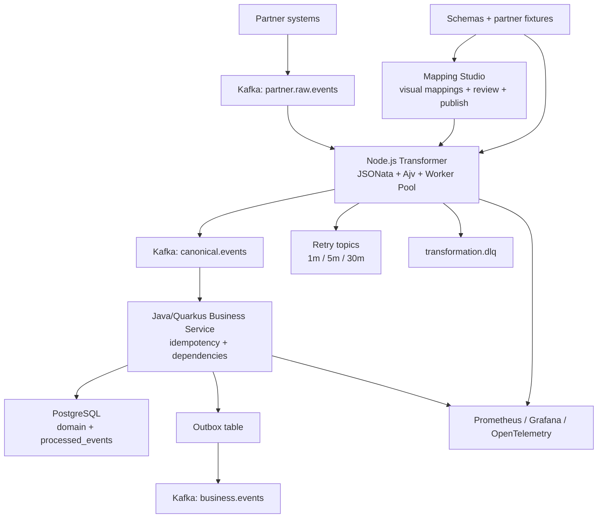

# CanonBridge

> **Enterprise Integration Platform** — Event-driven partner data transformation at scale.

CanonBridge eliminates the engineering bottleneck of multi-partner integrations. Instead of writing custom adapter code for every new partner, business users define field mappings visually and publish in minutes. The platform handles transformation, validation, ordering, retry, and observability automatically.

---

## The Problem We Solve

Every enterprise integration team hits the same wall:

```
Partner A format  ──┐
Partner B format  ──┤──► Custom adapter code ──► Business logic ──► Your system
Partner C format  ──┘     (per partner, per change, per team)
```

**With 50 partners, that becomes 125,000 lines of adapter code** — fragile, expensive, and slow to change.

CanonBridge replaces this with a single, configurable transformation engine:

```
Partner A format  ──┐
Partner B format  ──┤──► CanonBridge ──► Canonical format ──► Business logic ──► Your system
Partner C format  ──┘     (zero custom code)
```

| | Without CanonBridge | With CanonBridge |
|---|---|---|
| New partner onboarding | 2–4 weeks engineering | Minutes, no code |
| Mapping change | Code review + deploy | Visual edit + publish |
| 50 partners | ~$1,000,000 engineering cost | ~$80,000 platform cost |
| Mapping versioning | Ad-hoc, risky | Immutable, audited, rollbackable |
| Business control | Engineering dependency | Business user autonomy |

---

## Architecture



```
┌─────────────────────────────────────────────────────────────────┐
│                        Partner Ecosystem                        │
│  Partner A (JSON)   Partner B (JSON)   Partner C (JSON)        │
└──────────────┬──────────────┬──────────────┬───────────────────┘
               │              │              │
               ▼              ▼              ▼
┌─────────────────────────────────────────────────────────────────┐
│                    Kafka: raw.events topic                       │
│              (per-tenant, per-partner partitioning)             │
└──────────────────────────────┬──────────────────────────────────┘
                               │
                               ▼
┌─────────────────────────────────────────────────────────────────┐
│               Node.js Transformer Service                        │
│                                                                  │
│  ┌─────────────┐  ┌──────────────┐  ┌─────────────────────┐    │
│  │ Mapping     │  │ JSONata      │  │ Ajv Schema          │    │
│  │ Cache       │  │ Engine       │  │ Validation          │    │
│  └─────────────┘  └──────────────┘  └─────────────────────┘    │
│  ┌─────────────┐  ┌──────────────┐  ┌─────────────────────┐    │
│  │ Worker Pool │  │ Retry Logic  │  │ DLQ Handler         │    │
│  └─────────────┘  └──────────────┘  └─────────────────────┘    │
└──────────────────────────────┬──────────────────────────────────┘
                               │
                               ▼
┌─────────────────────────────────────────────────────────────────┐
│                 Kafka: canonical.events topic                    │
│               (stable schema, validated, versioned)             │
└──────────────────────────────┬──────────────────────────────────┘
                               │
                               ▼
┌─────────────────────────────────────────────────────────────────┐
│             Java/Quarkus Business Consumer Service               │
│                                                                  │
│  ┌─────────────┐  ┌──────────────┐  ┌─────────────────────┐    │
│  │ Idempotency │  │ Dependency   │  │ Outbox Pattern      │    │
│  │ Guard       │  │ Ordering     │  │ Publisher           │    │
│  └─────────────┘  └──────────────┘  └─────────────────────┘    │
└──────────────────────────────┬──────────────────────────────────┘
                               │
                               ▼
┌─────────────────────────────────────────────────────────────────┐
│             PostgreSQL                    Kafka                  │
│  domain_tables  processed_events  │  business.events topic      │
│  pending_deps   outbox_events     │  (downstream consumers)     │
└─────────────────────────────────────────────────────────────────┘

┌─────────────────────────────────────────────────────────────────┐
│                     Mapping Studio (React UI)                    │
│   Upload sample ─► Drag-and-drop fields ─► Preview ─► Publish  │
│   Immutable versions · Semantic versioning · Audit trail        │
└─────────────────────────────────────────────────────────────────┘

┌─────────────────────────────────────────────────────────────────┐
│                        Observability                            │
│   Prometheus · Grafana · OpenTelemetry tracing · Alerting       │
└─────────────────────────────────────────────────────────────────┘
```

---

## Example: Raw Partner Event to Canonical Event

The repository now includes a complete sample mapping package:

- Raw input schema: [`partners/acme-marketplace/order-created/input.v1.schema.json`](./partners/acme-marketplace/order-created/input.v1.schema.json)
- JSONata mapping: [`partners/acme-marketplace/order-created/inbound.v1.jsonata`](./partners/acme-marketplace/order-created/inbound.v1.jsonata)
- Canonical schema: [`schemas/canonical/order-created.v1.schema.json`](./schemas/canonical/order-created.v1.schema.json)
- Fixture pair: [`valid-order.input.json`](./partners/acme-marketplace/order-created/fixtures/valid-order.input.json) → [`valid-order.expected.json`](./partners/acme-marketplace/order-created/fixtures/valid-order.expected.json)

**Before: partner-specific payload**

```json
{
  "partnerId": "acme-marketplace",
  "eventType": "OrderCreated",
  "payload": {
    "order_header": {
      "order_id": "ORD-123",
      "order_date": "2026-05-10",
      "status": "A"
    },
    "customer": {
      "full_name": "  Ada Lovelace  ",
      "email": ""
    }
  }
}
```

**After: canonical business event**

```json
{
  "eventType": "CanonicalOrderCreated",
  "schemaVersion": "v1",
  "payload": {
    "orderId": "ORD-123",
    "customerName": "Ada Lovelace",
    "customerEmail": "no-reply@test.com",
    "status": "ACTIVE",
    "totalAmount": 250.5
  }
}
```

---

## Key Design Decisions

| Decision | Choice | Why |
|---|---|---|
| Message broker | Apache Kafka | Replay, audit, consumer group scaling, backpressure |
| Transformation | JSONata | Readable, versionable, sandboxed, no dependencies |
| Validation | Ajv (JSON Schema) | Compiled validators, fast, standard format |
| Business layer | Java + Quarkus | JVM reliability, native compilation, dependency injection |
| Transformation layer | Node.js + TypeScript | Fast JSON handling, JSONata native runtime |
| Consistency | Outbox pattern | No data loss between DB write and event publish |
| Offset management | Manual commit | Offset only after successful produce or DLQ |
| Error handling | Retry topics + DLQ | Temporary vs permanent failure classification |
| Idempotency | Event ID dedup | Safe reprocessing under at-least-once delivery |
| Versioning | Immutable mapping versions | Rollback in seconds, full audit trail |

Full rationale with tradeoffs: [docs/adr/](./docs/adr/)

---

## Enterprise Capabilities

### Multi-Tenant Model
- Every event envelope carries `tenantId`, `partnerId`, `eventType`, and `schemaVersion`.
- Kafka partitioning should preserve tenant and partner ordering boundaries.
- Mapping definitions are versioned per tenant/partner/event/schema tuple.
- Runtime quotas, rate limits, DLQ views, and audit access should be scoped by tenant.

### Reliability
- **At-least-once delivery** with idempotent processing — no silent data loss
- **Transactional outbox** — DB write and event publish are atomic
- **Three-tier retry** — 1m / 5m / 30m backoff before DLQ
- **Poison pill isolation** — one bad message cannot block a partition
- **Graceful shutdown** — in-flight messages complete before process exit

### Scalability
- Horizontal scaling via Kafka partition expansion
- Worker pool isolates CPU-bound JSONata from I/O event loop
- Tenant-level rate limiting and resource quotas
- Consumer lag-driven autoscaling

### Security
- **mTLS** between all services
- **RBAC** on every mapping lifecycle action (draft → review → publish → rollback)
- **PII masking** in all logs and UI previews by policy
- **Per-tenant encryption keys** at rest
- **Audit trail** on every mapping change, publish, and payload access
- JSONata execution sandboxed — no file, network, or secret access

### Observability
- **Distributed tracing** from ingress to downstream (OpenTelemetry)
- **Correlation ID** propagated through every Kafka hop
- **Partner health dashboards** — per-tenant DLQ rate, lag, transformation p99
- **SLO tracking** — p99 < 200ms, DLQ rate < 0.1%, lag < 1000 messages
- Alerting via PagerDuty (P1), Slack (P2/P3), Email (P4)

### Governance
- Immutable mapping versions with full change history
- Schema compatibility enforcement before publish
- Data lineage from raw partner event to business domain event
- Configurable retention per tenant (GDPR-aware)
- Complete audit trail for compliance

---

## Project Status

**Phase**: Architecture & Design complete. Implementation pending.

| Layer | Status |
|---|---|
| Architecture documentation | Complete |
| ADR (decision records) | Complete |
| Kubernetes manifests | Complete |
| CI/CD pipelines | Complete |
| Security design | Complete |
| Observability design | Complete |
| Canonical schemas and sample partner fixture | Complete |
| Local Kafka/PostgreSQL/Prometheus/Grafana compose | Complete |
| Service implementation | Pending |
| Mapping Studio UI | Pending |
| Integration tests | Pending |

---

## Documentation

| Audience | Start Here |
|---|---|
| **Architects / CTOs** | [Architecture Overview](./docs/architecture/01-overview.md) · [ADRs](./docs/adr/) |
| **Backend Engineers** | [Transformer Guide](./docs/implementation/TRANSFORMER_NODEJS_GUIDE.md) · [Quarkus Guide](./docs/implementation/SERVICES_JAVA_QUARKUS_GUIDE.md) |
| **DevOps / SRE** | [Deployment Guide](./docs/deployment/setup-guide.md) · [Runbook](./docs/operations/08-runbook.md) · [DR](./docs/operations/06-disaster-recovery.md) |
| **Product / Business** | [Product Overview](./docs/product/overview.md) · [Mapping Studio](./docs/product/01-mapping-studio-product-requirements.md) |
| **Security** | [Security Controls](./docs/implementation/10-security.md) · [Threat Model](./docs/adr/ADR-009-security-threat-model.md) |
| **Data Teams** | [Data Governance](./docs/governance/01-data-governance.md) · [Schema Strategy](./docs/governance/02-schema-registry.md) |
| **Everyone** | [Documentation Hub](./docs/README.md) · [Getting Started](./docs/getting-started.md) |

---

## Quick Start (Local)

```bash
# Start all infrastructure
docker-compose up -d

# Services available at:
# Grafana:    http://localhost:3000  (admin/admin)
# Prometheus: http://localhost:9090
# Kafka UI:   http://localhost:8080
# Kafka:      localhost:9092
# Schema Registry: docker-compose --profile schema-registry up -d
# PostgreSQL: localhost:5432
```

Validate the planning-level schemas and sample mapping fixture:

```bash
npm install --no-package-lock
npm run test:schema-compatibility
npm run test:mapping-fixtures
```

Full setup: [docs/deployment/DOCKER_COMPOSE_LOCAL.md](./docs/deployment/DOCKER_COMPOSE_LOCAL.md)

---

## Technology Stack

| Layer | Technology | Version Target |
|---|---|---|
| Transformation | Node.js + TypeScript | 20 LTS |
| Transformation DSL | JSONata | 2.x |
| Schema Validation | Ajv | 8.x |
| HTTP Framework | Fastify | 4.x |
| Business Services | Java + Quarkus | 3.x |
| Message Broker | Apache Kafka | 3.x |
| Database | PostgreSQL | 15+ |
| Orchestration | Kubernetes | 1.28+ |
| Service Mesh | Istio (optional) | 1.19+ |
| Metrics | Prometheus + Grafana | Latest |
| Tracing | OpenTelemetry | Latest |
| Frontend | React + TypeScript | 18+ |

---

## License

Proprietary — All rights reserved.
