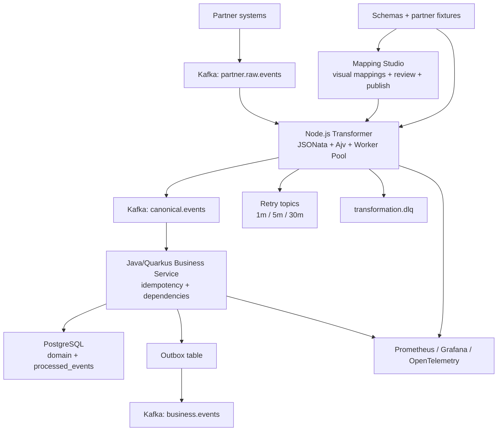

# CanonBridge

> **Enterprise Integration Platform** — Event-driven partner data transformation at scale.

> ✅ **Project Status**: **DEVELOPMENT PHASE** — 86% Complete
> - **Code**: Core services implemented and tested
> - **Backend**: Quarkus services, Kafka integration, database layer complete
> - **Frontend**: Angular Mapping Studio with wizard, live preview, and auto-save
> - **Transformer**: Node.js transformation engine with JSONata, validation, and retry logic
> - **Infrastructure**: Docker Compose, Kubernetes manifests, CI/CD pipelines ready
> - **Production Ready**: 2-3 weeks (pending auth integration, outbox consumer, and integration tests)
>
> See [10_SYSTEM_SUPPORT_AUDIT.md](docs/project/10_SYSTEM_SUPPORT_AUDIT.md) and [PROJECT_GAPS.md](docs/project/PROJECT_GAPS.md) for the latest support audit and remaining gaps.

CanonBridge eliminates the engineering bottleneck of multi-partner integrations. Instead of writing custom adapter code for every new partner, business users define field mappings visually and publish in minutes. The platform handles transformation, validation, ordering, retry, and observability automatically.

---

## The Problem We Solve

Every enterprise integration team hits the same wall:

```
Partner A format  ──┐
Partner B format  ──┤──► Custom adapter code ──► Business logic ──► Your system
Partner C format  ──┘     (per partner, per change, per team)
```

**With 50 partners, that becomes 125,000 lines of adapter code** — fragile, expensive, and slow to change.

CanonBridge replaces this with a single, configurable transformation engine:

```
Partner A format  ──┐
Partner B format  ──┤──► CanonBridge ──► Canonical format ──► Business logic ──► Your system
Partner C format  ──┘     (zero custom code)
```

| | Without CanonBridge | With CanonBridge |
|---|---|---|
| New partner onboarding | 2–4 weeks engineering | Minutes, no code |
| Mapping change | Code review + deploy | Visual edit + publish |
| 50 partners | ~$1,000,000 engineering cost | ~$80,000 platform cost |
| Mapping versioning | Ad-hoc, risky | Immutable, audited, rollbackable |
| Business control | Engineering dependency | Business user autonomy |

---

## Architecture



```
┌─────────────────────────────────────────────────────────────────┐
│                        Partner Ecosystem                        │
│  Partner A (JSON)   Partner B (JSON)   Partner C (JSON)        │
└──────────────┬──────────────┬──────────────┬───────────────────┘
               │              │              │
               ▼              ▼              ▼
┌─────────────────────────────────────────────────────────────────┐
│                    Kafka: raw.events topic                       │
│              (per-tenant, per-partner partitioning)             │
└──────────────────────────────┬──────────────────────────────────┘
                               │
                               ▼
┌─────────────────────────────────────────────────────────────────┐
│               Node.js Transformer Service                        │
│                                                                  │
│  ┌─────────────┐  ┌──────────────┐  ┌─────────────────────┐    │
│  │ Mapping     │  │ JSONata      │  │ Ajv Schema          │    │
│  │ Cache       │  │ Engine       │  │ Validation          │    │
│  └─────────────┘  └──────────────┘  └─────────────────────┘    │
│  ┌─────────────┐  ┌──────────────┐  ┌─────────────────────┐    │
│  │ Worker Pool │  │ Retry Logic  │  │ DLQ Handler         │    │
│  └─────────────┘  └──────────────┘  └─────────────────────┘    │
└──────────────────────────────┬──────────────────────────────────┘
                               │
                               ▼
┌─────────────────────────────────────────────────────────────────┐
│                 Kafka: canonical.events topic                    │
│               (stable schema, validated, versioned)             │
└──────────────────────────────┬──────────────────────────────────┘
                               │
                               ▼
┌─────────────────────────────────────────────────────────────────┐
│             Java/Quarkus Business Consumer Service               │
│                                                                  │
│  ┌─────────────┐  ┌──────────────┐  ┌─────────────────────┐    │
│  │ Idempotency │  │ Dependency   │  │ Outbox Pattern      │    │
│  │ Guard       │  │ Ordering     │  │ Publisher           │    │
│  └─────────────┘  └──────────────┘  └─────────────────────┘    │
└──────────────────────────────┬──────────────────────────────────┘
                               │
                               ▼
┌─────────────────────────────────────────────────────────────────┐
│             PostgreSQL                    Kafka                  │
│  domain_tables  processed_events  │  business.events topic      │
│  pending_deps   outbox_events     │  (downstream consumers)     │
└─────────────────────────────────────────────────────────────────┘

┌─────────────────────────────────────────────────────────────────┐
│                    Mapping Studio (Angular UI)                   │
│   Upload sample ─► Drag-and-drop fields ─► Preview ─► Publish  │
│   Immutable versions · Semantic versioning · Audit trail        │
└─────────────────────────────────────────────────────────────────┘

┌─────────────────────────────────────────────────────────────────┐
│                        Observability                            │
│   Prometheus · Grafana · OpenTelemetry tracing · Alerting       │
└─────────────────────────────────────────────────────────────────┘
```

---

## Example: Raw Partner Event to Canonical Event

The repository now includes a complete sample mapping package:

- Raw input schema: [`services/transformer/partners/acme-marketplace/order-created/input.v1.schema.json`](./services/transformer/partners/acme-marketplace/order-created/input.v1.schema.json)
- JSONata mapping: [`services/transformer/partners/acme-marketplace/order-created/inbound.v1.jsonata`](./services/transformer/partners/acme-marketplace/order-created/inbound.v1.jsonata)
- Canonical schema: [`services/transformer/schemas/canonical/order-created.v1.schema.json`](./services/transformer/schemas/canonical/order-created.v1.schema.json)
- Fixture pair: [`valid-order.input.json`](./services/transformer/partners/acme-marketplace/order-created/fixtures/valid-order.input.json) -> [`valid-order.expected.json`](./services/transformer/partners/acme-marketplace/order-created/fixtures/valid-order.expected.json)

**Before: partner-specific payload**

```json
{
  "partnerId": "acme-marketplace",
  "eventType": "OrderCreated",
  "payload": {
    "order_header": {
      "order_id": "ORD-123",
      "order_date": "2026-05-10",
      "status": "A"
    },
    "customer": {
      "full_name": "  Ada Lovelace  ",
      "email": ""
    }
  }
}
```

**After: canonical business event**

```json
{
  "eventType": "CanonicalOrderCreated",
  "schemaVersion": "v1",
  "payload": {
    "orderId": "ORD-123",
    "customerName": "Ada Lovelace",
    "customerEmail": "no-reply@test.com",
    "status": "ACTIVE",
    "totalAmount": 250.5
  }
}
```

---

## Key Design Decisions

| Decision | Choice | Why |
|---|---|---|
| Message broker | Apache Kafka | Replay, audit, consumer group scaling, backpressure |
| Transformation | JSONata | Readable, versionable, sandboxed, no dependencies |
| Validation | Ajv (JSON Schema) | Compiled validators, fast, standard format |
| Business layer | Java + Quarkus | JVM reliability, native compilation, dependency injection |
| Transformation layer | Node.js + TypeScript | Fast JSON handling, JSONata native runtime |
| Consistency | Outbox pattern | No data loss between DB write and event publish |
| Offset management | Manual commit | Offset only after successful produce or DLQ |
| Error handling | Retry topics + DLQ | Temporary vs permanent failure classification |
| Idempotency | Event ID dedup | Safe reprocessing under at-least-once delivery |
| Versioning | Immutable mapping versions | Rollback in seconds, full audit trail |

Full rationale with tradeoffs: [docs/adr/](./docs/adr/)

---

## Enterprise Capabilities

### Multi-Tenant Model
- Every event envelope carries `tenantId`, `partnerId`, `eventType`, and `schemaVersion`.
- Kafka partitioning should preserve tenant and partner ordering boundaries.
- Mapping definitions are versioned per tenant/partner/event/schema tuple.
- Runtime quotas, rate limits, DLQ views, and audit access should be scoped by tenant.

### Reliability
- **At-least-once delivery** with idempotent processing — no silent data loss
- **Transactional outbox** — DB write and event publish are atomic
- **Three-tier retry** — 1m / 5m / 30m backoff before DLQ
- **Poison pill isolation** — one bad message cannot block a partition
- **Graceful shutdown** — in-flight messages complete before process exit

### Scalability
- Horizontal scaling via Kafka partition expansion
- Worker pool isolates CPU-bound JSONata from I/O event loop
- Tenant-level rate limiting and resource quotas
- Consumer lag-driven autoscaling

### Security
- **mTLS** between all services
- **RBAC** on every mapping lifecycle action (draft → review → publish → rollback)
- **PII masking** in all logs and UI previews by policy
- **Per-tenant encryption keys** at rest
- **Audit trail** on every mapping change, publish, and payload access
- JSONata execution sandboxed — no file, network, or secret access

### Observability
- **Distributed tracing** from ingress to downstream (OpenTelemetry)
- **Correlation ID** propagated through every Kafka hop
- **Partner health dashboards** — per-tenant DLQ rate, lag, transformation p99
- **SLO tracking** — p99 < 200ms, DLQ rate < 0.1%, lag < 1000 messages
- Alerting via PagerDuty (P1), Slack (P2/P3), Email (P4)

### Governance
- Immutable mapping versions with full change history
- Schema compatibility enforcement before publish
- Data lineage from raw partner event to business domain event
- Configurable retention per tenant (GDPR-aware)
- Complete audit trail for compliance

---

## Project Status

**Current Phase**: Phase 3 - Core Implementation (86% Complete)<br>
**Code Status**: Core services implemented and tested<br>
**Documentation**: Comprehensive architecture and implementation docs

> 📋 **See [10_SYSTEM_SUPPORT_AUDIT.md](docs/project/10_SYSTEM_SUPPORT_AUDIT.md) for the latest support audit and remaining gaps**

| Component | Status | Notes |
|-----------|--------|-------|
| Architecture documentation | ✅ Complete | Comprehensive design docs with ADRs |
| Transformer Service (Node.js) | ✅ Complete | JSONata engine, validation, retry, tests |
| Mapping Studio API (Java/Quarkus) | ✅ 75% Complete | Auth, DB, CRUD, Kafka integration done |
| Mapping Studio UI (Angular) | ✅ 90% Complete | Wizard, live preview, auto-save, undo/redo |
| Mock Services | ✅ 85% Complete | Docker compose, demo scenarios ready |
| Kubernetes manifests | ✅ Complete | Production-ready K8s configs |
| CI/CD pipelines | ✅ Complete | GitHub Actions for build and deploy |
| Security design | ✅ Complete | Threat model defined (implementation pending) |
| Observability | ✅ Complete | Prometheus, Grafana, OpenTelemetry ready |
| Integration tests | ⏳ In Progress | Testcontainers setup needed |
| Outbox consumer | ⏳ Pending | Critical for production atomicity |
| OIDC/OAuth2 integration | ⏳ Pending | Replace demo auth with real OIDC |

**Critical Path to Production** (2-3 weeks):
1. ✅ Complete Mapping Studio wizard UI enhancements
2. ⏳ Implement OIDC authentication (replace hardcoded demo users)
3. ⏳ Build outbox consumer for atomicity guarantees
4. ⏳ Add integration tests with Testcontainers
5. ⏳ Security hardening (move secrets to .env, add interceptors)

See [10_SYSTEM_SUPPORT_AUDIT.md](docs/project/10_SYSTEM_SUPPORT_AUDIT.md) for the latest technical audit.

---

## Documentation

| Audience | Start Here |
|---|---|
| **New to Project** | [Project Summary](./docs/project/PROJECT_SUMMARY.md) · [Getting Started](./docs/getting-started.md) |
| **Product Managers** | [Strategy](./docs/project/STRATEGY.md) · [Product Overview](./docs/product/overview.md) |
| **Architects / CTOs** | [Architecture Overview](./docs/architecture/01-overview.md) · [ADRs](./docs/adr/) |
| **Backend Engineers** | [MVP Definition](./docs/project/MVP_DEFINITION.md) · [Transformer Guide](./docs/implementation/TRANSFORMER_NODEJS_GUIDE.md) |
| **Frontend Engineers** | [Mapping Studio](./docs/product/README.md) · [Angular UI](./mapping-studio-ui/README.md) |
| **DevOps / SRE** | [Deployment Guide](./docs/deployment/setup-guide.md) · [Runbook](./docs/operations/08-runbook.md) |
| **Project Gaps** | [Project Gaps](./docs/project/PROJECT_GAPS.md) · [10 System Support Audit](./docs/project/10_SYSTEM_SUPPORT_AUDIT.md) |
| **Everyone** | [Master Roadmap](./docs/project/MASTER_ROADMAP.md) · [Documentation Hub](./docs/README.md) |

**Core Documents**:
- [10 System Support Audit](./docs/project/10_SYSTEM_SUPPORT_AUDIT.md) - Current support gaps and next steps
- [Project Gaps](./docs/project/PROJECT_GAPS.md) - Consolidated gap register for production and 10-system readiness
- [Master Roadmap](./docs/project/MASTER_ROADMAP.md) - Official project plan
- [Project Summary](./docs/project/PROJECT_SUMMARY.md) - Quick overview
- [Brand Identity](./docs/project/BRAND_IDENTITY.md) - Name, vision, messaging
- [MVP Definition](./docs/project/MVP_DEFINITION.md) - What we build first
- [Strategy](./docs/project/STRATEGY.md) - Validation and go-to-market
- [Performance Targets](./docs/project/PERFORMANCE_TARGETS.md) - Performance goals
- [Customer Discovery Kit](./docs/project/CUSTOMER_DISCOVERY_KIT.md) - Validation interview kit

---

## Quick Start

### Running the Development Environment

```bash
# Start all services (Kafka, PostgreSQL, Redis, Mock services)
docker-compose up -d

# Check service health
docker-compose ps

# View logs
docker-compose logs -f transformer
docker-compose logs -f mapping-studio-api

# Stop all services
docker-compose down
```

### Running the Mock Demo

```bash
cd services/canonbridge-mock
docker-compose up -d

# Run the sales demonstration script
./demo.sh

# Explore additional scenarios
curl http://localhost:8080/api/payments/latest \
  -H "X-API-Key: demo-api-key-12345"
```

### Development Workflow

**Backend (Mapping Studio API)**:
```bash
cd services/mapping-studio-api
./mvnw quarkus:dev
```

**Frontend (Mapping Studio UI)**:
```bash
cd mapping-studio-ui
npm install
npm start
# Open http://localhost:4200
```

**Transformer Service**:
```bash
cd services/transformer
npm install
npm run dev
```

See [docs/deployment/setup-guide.md](./docs/deployment/setup-guide.md) for detailed setup instructions.

---

## Technology Stack

| Layer | Technology | Version Target |
|---|---|---|
| Transformation | Node.js + TypeScript | 20 LTS |
| Transformation DSL | JSONata | 2.x |
| Schema Validation | Ajv | 8.x |
| HTTP Framework | Fastify | 5.x |
| Business Services | Java + Quarkus | 3.x |
| Message Broker | Apache Kafka | 3.x |
| Database | PostgreSQL | 15+ |
| Orchestration | Kubernetes | 1.28+ |
| Service Mesh | Istio (optional) | 1.19+ |
| Metrics | Prometheus + Grafana | Latest |
| Tracing | OpenTelemetry | Latest |
| Frontend | Angular + TypeScript | 21.x |

---

## License

Proprietary — All rights reserved.
