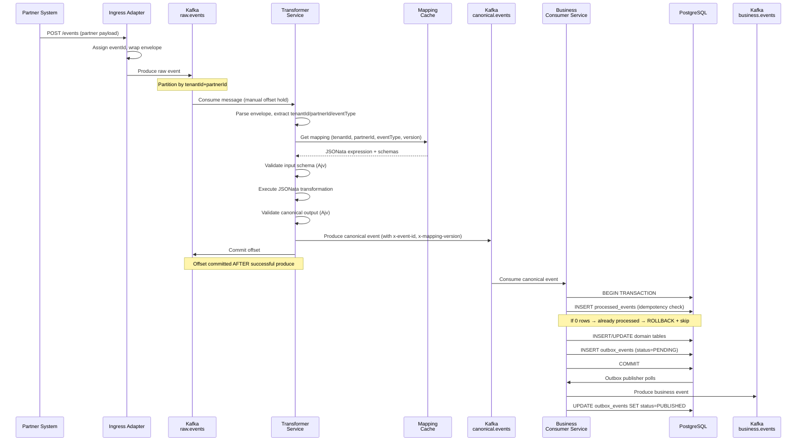
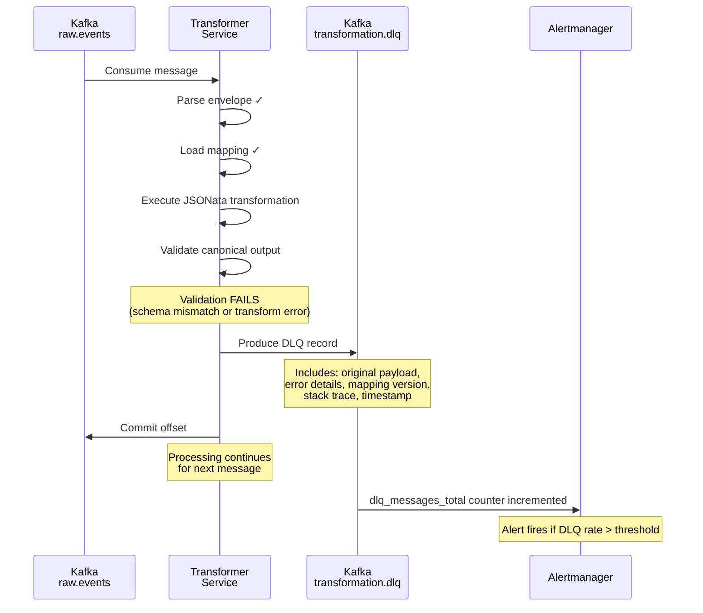
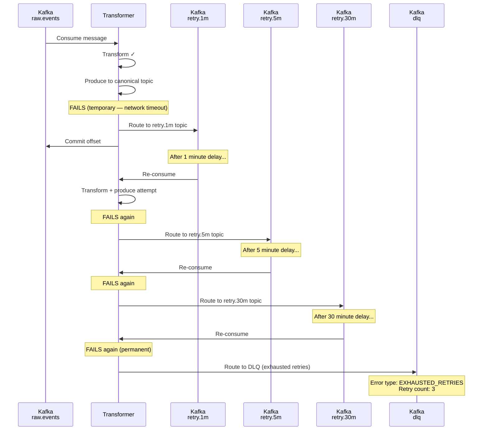
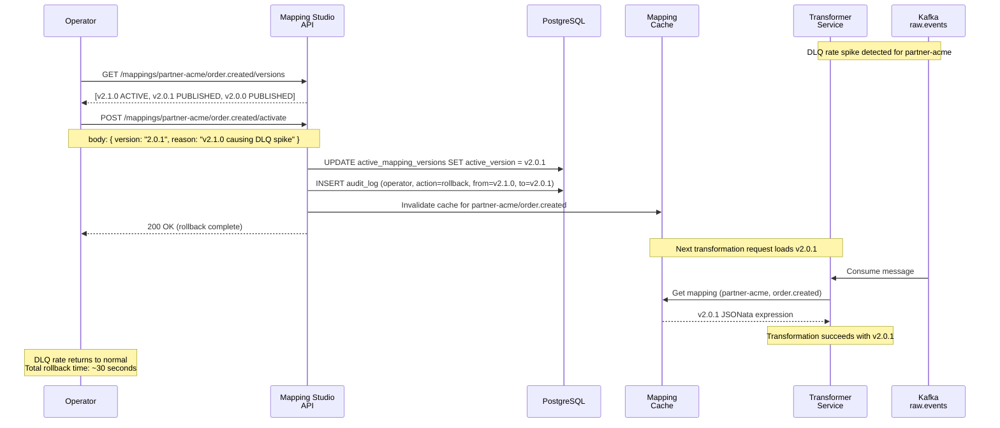
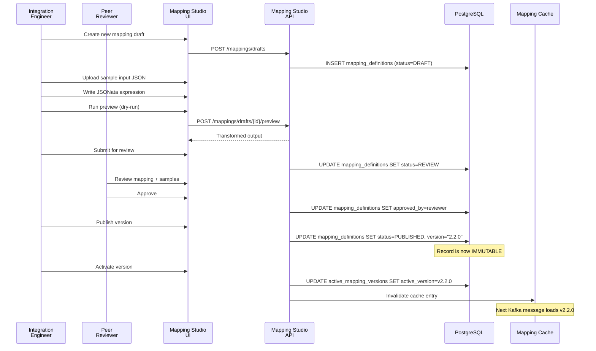
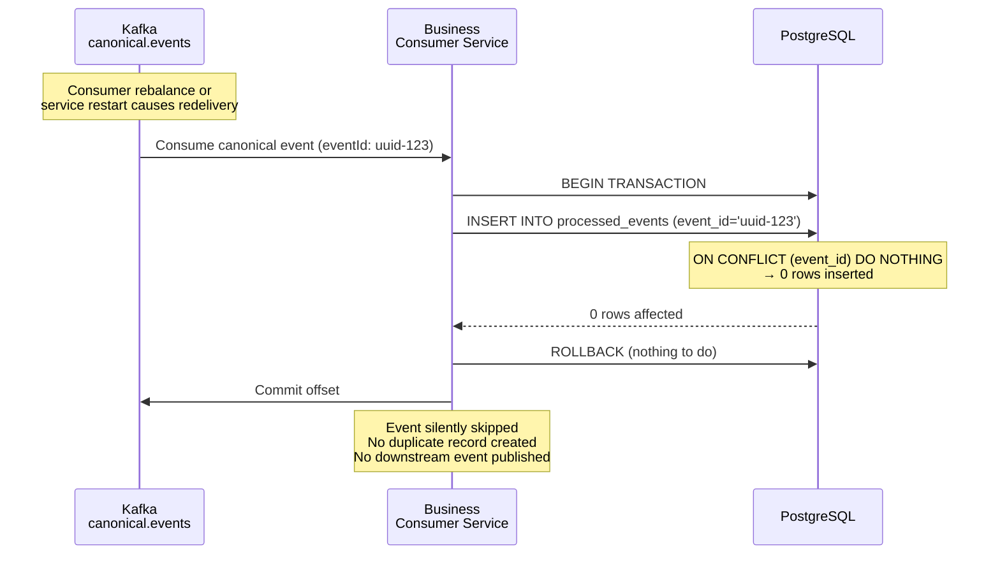
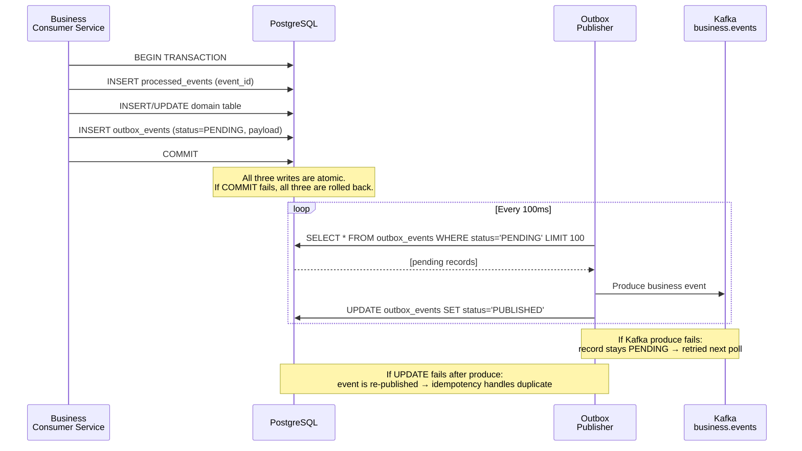
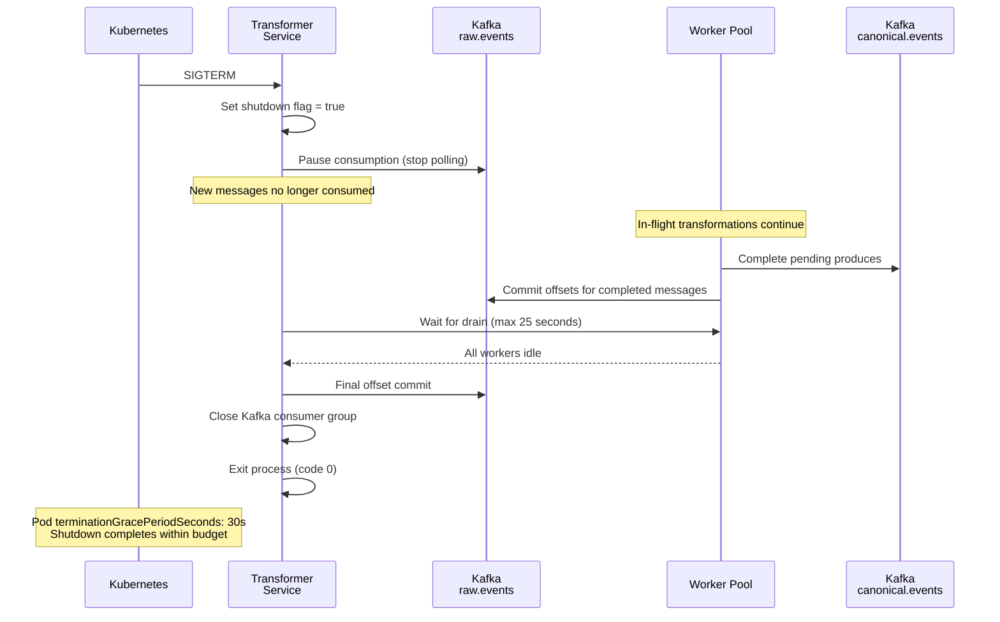
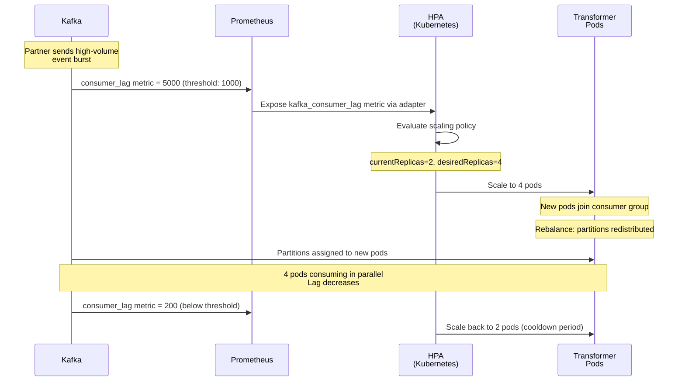

# Sequence Diagrams

Mermaid diagrams for all critical platform flows. Render in GitHub, GitLab, or any Mermaid-compatible viewer.

---

## 1. Happy Path: Event Ingestion and Transformation

The standard flow from partner event to business domain record.

---

## 2. Transformation Failure: DLQ Flow

When JSONata transformation fails permanently (bad mapping, schema mismatch).

---

## 3. Retry Flow: Temporary Failure

When a downstream system is temporarily unavailable (transient network error, DB timeout).

---

## 4. Mapping Version Rollback

Operator rolls back a broken mapping version without deployment.

---

## 5. Mapping Publish Lifecycle

Full lifecycle from draft creation to production activation.

---

## 6. Duplicate Event Handling (Idempotency)

Kafka redelivers an already-processed event. Business service handles it transparently.

---

## 7. Outbox Pattern: Transactional Event Publish

Ensures domain write and event publish are always consistent.

---

## 8. Graceful Shutdown

Service receives SIGTERM and drains in-flight messages before exit.

---

## 9. Consumer Lag Autoscaling

HPA scales transformer pods when consumer lag grows.

---

## See Also

- [Architecture Overview](./01-overview.md)
- [Error Handling](./07-error-handling.md)
- [Ordering and Dependencies](./08-ordering-dependencies.md)
- [Outbox Pattern](./09-outbox-pattern.md)
- [ADR-004: Manual Offset Commit](../adr/ADR-004-manual-kafka-offset-commit.md)
- [ADR-005: Outbox Pattern](../adr/ADR-005-outbox-pattern.md)
- [ADR-008: Idempotency](../adr/ADR-008-event-id-idempotency.md)
